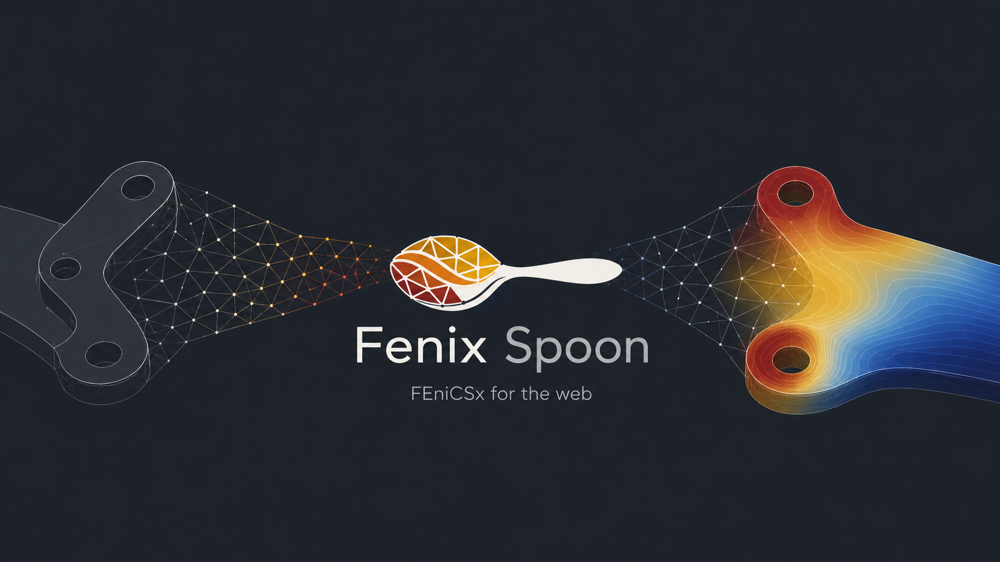
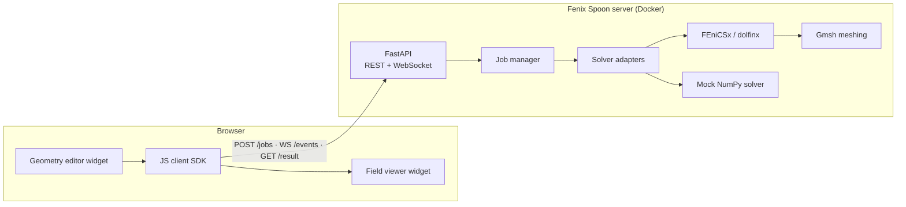

<p align="center">
  
</p>

**A Swiss-army toolkit for building web-based engineering applications powered by [FEniCSx](https://fenicsproject.org/).**

📖 **[Documentation](https://mandaloriat.github.io/fenix-spoon/)** — get started by
[embedding the widgets](https://mandaloriat.github.io/fenix-spoon/start-embed-widgets/),
[deploying the server](https://mandaloriat.github.io/fenix-spoon/start-deploy-server/), or
[writing a solver adapter](https://mandaloriat.github.io/fenix-spoon/start-write-a-solver/).

Fenix Spoon is an open-source (MIT) toolkit that packages everything you need to put a finite-element
solver behind a web page: a ready-to-deploy simulation server, a clean HTTP/WebSocket protocol for
submitting jobs and streaming results, and embeddable browser widgets for geometry input and field
visualization.

The canonical use case: an engineer opens a web page, drags the control points of a 2D airfoil (or a
solenoid cross-section), presses *Run*, and watches the simulation result appear live — no local
installation, no desktop tooling, just a browser talking to a FEniCSx server.

The browser is the first client, not the only planned one. The same declarative core — named
solvers, typed parameters, jobs, results — is meant to be drivable from a local process too:
scripts, CLI, and software agents on a machine that already has FEniCSx, over a structured local
interface with compact answers instead of a web app. That direction is
[M2.5](docs/03-roadmap.md#m25-local-automation-and-agent-interface), designed in
[docs/07-local-agent-interface.md](docs/07-local-agent-interface.md). **All ten of its items have
landed** — the transport-neutral core, progressive capability discovery, the local workspace,
compact results, the result cache, the study abstraction, and **both local transports**. `fenix-spoon rpc --stdio`
speaks [JSON-RPC 2.0 over pipes](docs/08-json-rpc.md) with no port opened and no web framework
imported, so a script can ask what this installation can simulate, keep its designs under stable
ids, patch one control point of a geometry, re-solve by reference, read back an answer in a few
hundred bytes instead of a few hundred kilobytes, and have an unchanged design cost a lookup
rather than a solve. An [MCP adapter](docs/09-mcp.md) puts the same operations in front of a Model Context
Protocol host as thirteen tools, as an optional extra, and the same operations are a
[shell command and a Python API](docs/10-cli-and-python.md). A cross-transport conformance suite asserts that all five
renderings of an operation agree, and the vertical slice runs as a test against both the mock
and the FEniCSx solver.

> **Status: M1, M2 and M2.5 done, M3 mostly.** Five physics run end to end on real FEniCSx
> solves (potential flow, magnetostatics, steady and transient heat conduction, linear
> elasticity) and three of them have demo pages, the three browser packages — SDK, geometry editor,
> field viewer — are published from `client/`, and the airfoil demo is built from them.
> Pure-NumPy mock solvers mirror every FEniCSx one, so the full loop (edit geometry → submit →
> stream progress → render field) runs without installing FEniCSx at all. Jobs now persist
> across restarts, API keys and per-user quotas are available, solves can run in worker
> containers behind a Redis queue, and the stack is [load-tested](docs/06-load-test.md) at
> 50 concurrent clients. What remains for M3 is deployment packaging — see the
> [roadmap](docs/03-roadmap.md).
>
> **The wire protocol is at 1.9.** The last four minors came from adding physics rather than
> from planning: a transient needed a metric to say what it is taken over (1.6) and a way to
> index its instants (1.7), and elasticity needed a geometry that can *name* pieces of its own
> boundary (1.8) and a load case to say what happens there (1.9). Every one is additive — a
> 1.0 client still works.

## Why

Deploying FEniCS behind a web UI today means hand-rolling the same stack every time: a Docker image
with dolfinx, an API server, a job queue, a serialization format for meshes and fields, and a
JavaScript viewer. All the ingredients exist in the open-source ecosystem, but there is no glue —
see the [state-of-the-art survey](docs/01-state-of-the-art.md). Fenix Spoon is that glue.

## What's in the box

| Component | Where | Status |
|---|---|---|
| **Simulation server** — FastAPI app: job submission, WebSocket progress streaming, cancellation, wall-clock timeouts, cell budgets, result + artifact retrieval | [`server/`](server/) | ✅ working |
| **Solver adapter protocol** — plug any solver (FEniCSx, mock, anything Python) behind the same API via `SolverContext` (progress / cancel / artifacts) | [`server/fenixspoon/solvers/`](server/fenixspoon/solvers/) | ✅ working |
| **Mock solvers** — potential flow, magnetostatics, steady and transient heat conduction, and linear elasticity in pure NumPy; let you develop the front-end without FEniCSx | [`mock_laplace.py`](server/fenixspoon/solvers/mock_laplace.py), [`mock_magnetostatics.py`](server/fenixspoon/solvers/mock_magnetostatics.py), [`mock_heat.py`](server/fenixspoon/solvers/mock_heat.py), [`mock_elasticity.py`](server/fenixspoon/solvers/mock_elasticity.py), [`mock_transient_heat.py`](server/fenixspoon/solvers/mock_transient_heat.py) | ✅ working |
| **FEniCSx adapters** — the same five problems on unstructured Gmsh meshes, cross-validated against the mock solvers and against closed forms — Joukowski circulation, Kirsch stress concentration, `PL³/3EI` | [`dolfinx_poisson.py`](server/fenixspoon/solvers/dolfinx_poisson.py), [`dolfinx_magnetostatics.py`](server/fenixspoon/solvers/dolfinx_magnetostatics.py), [`dolfinx_heat.py`](server/fenixspoon/solvers/dolfinx_heat.py), [`dolfinx_elasticity.py`](server/fenixspoon/solvers/dolfinx_elasticity.py), [`dolfinx_transient_heat.py`](server/fenixspoon/solvers/dolfinx_transient_heat.py) | ✅ validated on dolfinx 0.11 (`pytest -m fenics`, CI job in the dolfinx image) |
| **Wire protocol** — JSON schemas for geometry (`domain2d`, `regions2d`), jobs, events, `grid2d`/`mesh2d`/`series1d` results, artifacts — with a conformance fixture corpus | [`docs/04-wire-protocol.md`](docs/04-wire-protocol.md), [`protocol/fixtures/`](protocol/fixtures/) | ✅ v0 implemented |
| **Progressive discovery** — ask what an installation *is*, list capabilities in a line each, describe one in the sections you need; solver adapters declare their metrics, artifacts and cost | [`core/discovery.py`](server/fenixspoon/core/discovery.py) | ✅ protocol 1.2 |
| **Local workspace** — versioned `geometry` / `material` / `design` objects as diffable JSON files under stable ids, edited with RFC 6902 patches, solved by reference | [`objects.py`](server/fenixspoon/objects.py), [`core/workspace.py`](server/fenixspoon/core/workspace.py) | ✅ core API (no HTTP yet) |
| **Compact results** — five response levels, declared engineering metrics, diagnostics, and nine bounded field queries (peak + location, integral, section, hotspots) that never move the array | [`core/results.py`](server/fenixspoon/core/results.py), [`fields.py`](server/fenixspoon/fields.py) | ✅ protocol 1.3 |
| **Result cache + provenance** — an identical resubmission is answered from the solve that already ran, opt-in per adapter, with `cached` and the pinned input revisions on every result | [`cache.py`](server/fenixspoon/cache.py) | ✅ protocol 1.4 |
| **Studies** — a sequence of solves that answers one question: mesh convergence refines until the metrics settle and reports the rung it settled at, rather than leaving a caller to run four jobs and eyeball them | [`core/studies.py`](server/fenixspoon/core/studies.py) | ✅ mesh convergence |
| **Time** — a metric declares whether it is taken over the payload or over the whole run, and a transient's instants are indexed by the artifacts that carry them: `frames` is derived from the files, so it cannot name one the result does not serve | [`frames.py`](server/fenixspoon/frames.py), [`solvers/base.py`](server/fenixspoon/solvers/base.py) | ✅ protocol 1.6–1.7 |
| **Named boundaries** — a geometry can name pieces of its own outline, by topology (`outer`, `obstacle`), by stable point id, or by position (`near`, `box`); each resolves to the `f(x) -> bool` predicate `locate_entities_boundary` takes, so a mock and a FEniCSx adapter cannot disagree about which edge was meant | [`boundaries.py`](server/fenixspoon/boundaries.py), [`geometry.py`](server/fenixspoon/geometry.py) | ✅ protocol 1.8 — *the load case that says what happens there is [#85](https://github.com/mandaloriat/fenix-spoon/issues/85)* |
| **JSON-RPC 2.0 over stdio** — `fenix-spoon rpc --stdio`: 26 methods, no port opened and no web framework imported, NDJSON out and both framings in | [`rpc/`](server/fenixspoon/rpc/), [`docs/08-json-rpc.md`](docs/08-json-rpc.md) | ✅ working |
| **MCP adapter** — the same operations as 13 tools for a Model Context Protocol host, bound to the RPC method table rather than to the core, so it cannot drift from the other transports | [`mcp_adapter.py`](server/fenixspoon/mcp_adapter.py), [`docs/09-mcp.md`](docs/09-mcp.md) | ✅ optional extra (`pip install "fenix-spoon[mcp]"`) |
| **CLI and Python API** — `fenix-spoon capability list`, `job submit`, `study run`… and the same operations in-process via `from fenixspoon import local` | [`commands.py`](server/fenixspoon/commands.py), [`local.py`](server/fenixspoon/local.py), [`docs/10-cli-and-python.md`](docs/10-cli-and-python.md) | ✅ working |
| **Cross-transport conformance** — one request rendered five ways must produce one answer, and one refusal must mean the same thing on each; the error partition lives in the shared fixture corpus | [`tests/test_conformance.py`](server/tests/test_conformance.py), [`protocol/fixtures/errors.json`](protocol/fixtures/errors.json) | ✅ working |
| **Browser demos** — the airfoil built from the three packages, plus zero-dependency versions of both airfoil and solenoid kept as protocol references | [`examples/airfoil-2d/`](examples/airfoil-2d/), [`examples/solenoid-2d/`](examples/solenoid-2d/) | ✅ working |
| **JS/TS SDK** — `@fenix-spoon/client`: typed protocol client with progress streaming, reconnection and runtime validators | [`client/packages/client/`](client/packages/client/) | ✅ working |
| **Geometry editor widget** — `<fs-geometry-2d>`: SVG-based parametric profile editor, keyboard-operable, emits protocol JSON | [`client/packages/geometry-2d/`](client/packages/geometry-2d/) | ✅ working |
| **Field viewer widget** — `<fs-viewer>`: canvas renderer *and explorer* for `grid2d`/`mesh2d` — colormaps, contours, probe, sections, zoom/pan, vector glyphs, integral curves, capability-driven tools, all on data already received | [`client/packages/viewer/`](client/packages/viewer/) | ✅ working |
| **Docker deployment** — one image with dolfinx + server, `docker compose up`; a worker override for API + Redis + N solver containers | [`Dockerfile`](server/Dockerfile), [`docker-compose.yml`](docker-compose.yml), [`docker-compose.workers.yml`](docker-compose.workers.yml) | ✅ working |
| **Distributed job execution** — `ExecutionBackend` with an in-process pool and an arq/Redis backend; progress crosses processes over pub/sub | [`backends.py`](server/fenixspoon/backends.py), [`worker.py`](server/fenixspoon/worker.py) | ✅ working |

## Quickstart (no FEniCSx required)

```bash
cd server
pip install -e ".[dev]"
uvicorn fenixspoon.main:app --reload
```

Then open <http://localhost:8000/> for the demo index — drag the airfoil's control points and
watch the flow field update, or resize a solenoid's iron core and watch the flux redistribute.
API docs (OpenAPI) live at <http://localhost:8000/docs>.

The widget-based airfoil page additionally needs the browser packages built; the server then
serves them at `/packages/`:

```bash
npm --prefix client install && npm --prefix client run build
```

With Docker (full FEniCSx runtime):

```bash
docker compose up --build
```

Or pull a published image instead of building — `ghcr.io/mandaloriat/fenix-spoon:latest`
for the FEniCSx runtime, `:latest-slim` for a ~100 MB image with the mock solvers only,
which is all front-end work needs.

For the multi-user shape — the API dispatching to worker containers rather than solving
itself — layer the worker override:

```bash
docker compose -f docker-compose.yml -f docker-compose.workers.yml up --scale worker=4
```

Without Docker, a conda environment works too (this is also how the FEniCSx test suite runs):

```bash
micromamba create -p ./fenicsenv -c conda-forge python=3.12 fenics-dolfinx python-gmsh \
    fastapi uvicorn pytest httpx
./fenicsenv/bin/pip install -e ./server
./fenicsenv/bin/pytest server/tests            # includes the `-m fenics` adapter tests
./fenicsenv/bin/uvicorn fenixspoon.main:app --app-dir server
```

## Server configuration

The server is configured from the environment; the defaults are meant for a laptop.

| Variable | Default | What it does |
|---|---|---|
| `FENIXSPOON_DATA_DIR` | `<tmp>/fenixspoon-jobs` | Where per-job artifacts, result payloads and the job database live. **Mount this** if job history should outlive the container |
| `FENIXSPOON_STORE` | `sqlite` | `sqlite` persists jobs under the data directory; `memory` keeps them in the process and loses them on restart |
| `FENIXSPOON_JOB_TIMEOUT` | `600` | Wall-clock seconds a solve may run; `0` disables. Cooperative — the worker is asked to stop |
| `FENIXSPOON_MAX_WORKERS` | core count | How many solves run at once *in-process*. Right for FEniCSx, which releases the GIL; lower it for Python-heavy solvers — see the [load test](docs/06-load-test.md) |
| `FENIXSPOON_REDIS_URL` | unset | Set it and the API stops solving: jobs go to a Redis queue that worker containers drain, and progress comes back over pub/sub. See [deployment](docs/05-deployment.md) |
| `FENIXSPOON_MAX_CELLS` | `2000000` | Cell budget for a single job; `0` disables. Checked at submit from the solver's own estimate, so an over-sized job is refused with an explanation instead of being killed halfway through |
| `FENIXSPOON_JOB_TTL` | `604800` (7 days) | How long a finished job's record, result and artifacts are kept; `0` keeps them forever. Swept hourly and at startup |
| `FENIXSPOON_API_KEYS` | unset (anonymous) | `"alice:secret,bob:secret"`. Set it and every route requires a key; each principal sees only its own jobs |
| `FENIXSPOON_CORS_ORIGINS` | `*`, or nothing when keys are set | Comma-separated allowed origins. Same-origin pages (including these demos) never need it |
| `FENIXSPOON_MAX_CONCURRENT_JOBS`<br>`FENIXSPOON_MAX_JOBS_PER_HOUR`<br>`FENIXSPOON_MAX_ARTIFACT_BYTES` | `0` (unlimited) | Per-principal quotas, refused at submit with a `429` |

Every finished job reports what it actually cost in the result's `stats` (`cells`, `dofs`,
`iterations`, `seconds` — whichever the adapter knows), which is what the caps should be set from.

Job history survives restarts: `GET /api/v1/jobs` pages through it, and a job that was mid-solve
when the process died comes back `failed` rather than hanging a client that polls it forever.

Locking a server to a team is one block of environment variables — see
[docs/05-deployment.md](docs/05-deployment.md), which also covers OIDC, reverse-proxy
WebSocket settings, and why there is no per-job memory ceiling yet.

## Architecture at a glance



The full design, including the trade-offs (server-side vs client-side rendering, job queue options,
serialization formats), is in [`docs/02-architecture.md`](docs/02-architecture.md).

## Repository layout

```
├── docs/               # Survey, architecture, roadmap, wire protocol
├── protocol/fixtures/  # Shared conformance corpus — read by both pytest and vitest
├── server/             # Python package `fenixspoon` (FastAPI app + solvers) and tests
├── client/             # npm workspace: @fenix-spoon/{client,geometry-2d,viewer}
├── examples/           # Self-contained browser demos (airfoil, solenoid)
└── docker-compose.yml
```

## Documentation

The [documentation site](https://mandaloriat.github.io/fenix-spoon/) is built from these
files; `make docs-serve` previews it locally.

1. [State of the art](docs/01-state-of-the-art.md) — what exists today, and the gap this project fills
2. [Architecture](docs/02-architecture.md) — components, choices, trade-offs
3. [Roadmap](docs/03-roadmap.md) — milestones M0 → M5
4. [Wire protocol](docs/04-wire-protocol.md) — the JSON contract between client and server
5. [Deployment](docs/05-deployment.md) — API keys, quotas, resource limits, CORS, reverse proxy
6. [Load test](docs/06-load-test.md) — the tested envelope, and how to reproduce it
7. [Protocol reference](docs/reference-protocol.md) — every model, generated from the code that validates it
8. [JSON-RPC over stdio](docs/08-json-rpc.md) — the local transport: methods, framing, errors
9. [MCP adapter](docs/09-mcp.md) — the tool vocabulary for Model Context Protocol hosts
10. [CLI and Python API](docs/10-cli-and-python.md) — the shell command and the in-process entrypoint
11. [Local agent interface](docs/07-local-agent-interface.md) — design draft for driving the same
   core from a local process (M2.5; the core, discovery, workspace, results, cache and the
   stdio transport have landed — the CLI, Python and MCP adapters have not)
10. [Decision records](docs/adr/index.md) — the few decisions that set a boundary rather than
    living next to one file's code

[CHANGELOG.md](CHANGELOG.md) records what changed for the people building on the toolkit; the
wire protocol's own history is in [docs/04-wire-protocol.md](docs/04-wire-protocol.md).

## Contributing

See [CONTRIBUTING.md](CONTRIBUTING.md). The roadmap issues are the best entry point.

## License

[MIT](LICENSE). Note that FEniCSx components (dolfinx, UFL, FFCx, Basix) are LGPL-3.0-or-later and
are used as external dependencies; the Docker images bundle them under their own licenses.
