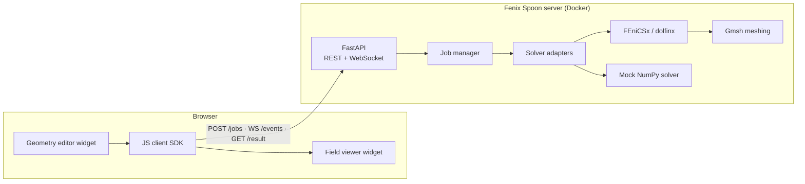

<p align="center">
  
</p>

**A Swiss-army toolkit for building web-based engineering applications powered by [FEniCSx](https://fenicsproject.org/).**

Fenix Spoon is an open-source (MIT) toolkit that packages everything you need to put a finite-element
solver behind a web page: a ready-to-deploy simulation server, a clean HTTP/WebSocket protocol for
submitting jobs and streaming results, and embeddable browser widgets for geometry input and field
visualization.

The canonical use case: an engineer opens a web page, drags the control points of a 2D airfoil (or a
solenoid cross-section), presses *Run*, and watches the simulation result appear live — no local
installation, no desktop tooling, just a browser talking to a FEniCSx server.

> **Status: M1 and M2 done.** Two physics examples run end to end on real FEniCSx solves
> (potential flow, magnetostatics), the three browser packages — SDK, geometry editor, field
> viewer — are published from `client/`, and the airfoil demo is built from them. Pure-NumPy mock
> solvers mirror every FEniCSx one, so the full loop (edit geometry → submit → stream progress →
> render field) runs without installing FEniCSx at all. Next up is production job execution:
> a real queue, persistence and auth — see the [roadmap](docs/03-roadmap.md).

## Why

Deploying FEniCS behind a web UI today means hand-rolling the same stack every time: a Docker image
with dolfinx, an API server, a job queue, a serialization format for meshes and fields, and a
JavaScript viewer. All the ingredients exist in the open-source ecosystem, but there is no glue —
see the [state-of-the-art survey](docs/01-state-of-the-art.md). Fenix Spoon is that glue.

## What's in the box

| Component | Where | Status |
|---|---|---|
| **Simulation server** — FastAPI app: job submission, WebSocket progress streaming, cancellation, wall-clock timeouts, cell budgets, result + artifact retrieval | [`server/`](server/) | ✅ working |
| **Solver adapter protocol** — plug any solver (FEniCSx, mock, anything Python) behind the same API via `SolverContext` (progress / cancel / artifacts) | [`server/fenixspoon/solvers/`](server/fenixspoon/solvers/) | ✅ working |
| **Mock solvers** — potential flow and magnetostatics in pure NumPy; let you develop the front-end without FEniCSx | [`mock_laplace.py`](server/fenixspoon/solvers/mock_laplace.py), [`mock_magnetostatics.py`](server/fenixspoon/solvers/mock_magnetostatics.py) | ✅ working |
| **FEniCSx adapters** — the same two problems on unstructured Gmsh meshes, cross-validated against the mock solvers | [`dolfinx_poisson.py`](server/fenixspoon/solvers/dolfinx_poisson.py), [`dolfinx_magnetostatics.py`](server/fenixspoon/solvers/dolfinx_magnetostatics.py) | ✅ validated on dolfinx 0.11 (`pytest -m fenics`, CI job in the dolfinx image) |
| **Wire protocol** — JSON schemas for geometry (`domain2d`, `regions2d`), jobs, events, `grid2d`/`mesh2d` results, artifacts — with a conformance fixture corpus | [`docs/04-wire-protocol.md`](docs/04-wire-protocol.md), [`protocol/fixtures/`](protocol/fixtures/) | ✅ v0 implemented |
| **Browser demos** — the airfoil built from the three packages, plus zero-dependency versions of both airfoil and solenoid kept as protocol references | [`examples/airfoil-2d/`](examples/airfoil-2d/), [`examples/solenoid-2d/`](examples/solenoid-2d/) | ✅ working |
| **JS/TS SDK** — `@fenix-spoon/client`: typed protocol client with progress streaming, reconnection and runtime validators | [`client/packages/client/`](client/packages/client/) | ✅ working |
| **Geometry editor widget** — `<fs-geometry-2d>`: SVG-based parametric profile editor, keyboard-operable, emits protocol JSON | [`client/packages/geometry-2d/`](client/packages/geometry-2d/) | ✅ working |
| **Field viewer widget** — `<fs-viewer>`: canvas renderer for `grid2d`/`mesh2d` with colormaps, contours and a hover probe | [`client/packages/viewer/`](client/packages/viewer/) | ✅ working |
| **Docker deployment** — one image with dolfinx + server, `docker compose up` | [`Dockerfile`](server/Dockerfile), [`docker-compose.yml`](docker-compose.yml) | ✅ scaffolded |

## Quickstart (no FEniCSx required)

```bash
cd server
pip install -e ".[dev]"
uvicorn fenixspoon.main:app --reload
```

Then open <http://localhost:8000/> for the demo index — drag the airfoil's control points and
watch the flow field update, or resize a solenoid's iron core and watch the flux redistribute.
API docs (OpenAPI) live at <http://localhost:8000/docs>.

The widget-based airfoil page additionally needs the browser packages built; the server then
serves them at `/packages/`:

```bash
npm --prefix client install && npm --prefix client run build
```

With Docker (full FEniCSx runtime):

```bash
docker compose up --build
```

Without Docker, a conda environment works too (this is also how the FEniCSx test suite runs):

```bash
micromamba create -p ./fenicsenv -c conda-forge python=3.12 fenics-dolfinx python-gmsh \
    fastapi uvicorn pytest httpx
./fenicsenv/bin/pip install -e ./server
./fenicsenv/bin/pytest server/tests            # includes the `-m fenics` adapter tests
./fenicsenv/bin/uvicorn fenixspoon.main:app --app-dir server
```

## Server configuration

The server is configured from the environment; the defaults are meant for a laptop.

| Variable | Default | What it does |
|---|---|---|
| `FENIXSPOON_DATA_DIR` | `<tmp>/fenixspoon-jobs` | Where per-job artifact files are written |
| `FENIXSPOON_JOB_TIMEOUT` | `600` | Wall-clock seconds a solve may run; `0` disables. Cooperative — the worker is asked to stop |
| `FENIXSPOON_MAX_CELLS` | `2000000` | Cell budget for a single job; `0` disables. Checked at submit from the solver's own estimate, so an over-sized job is refused with an explanation instead of being killed halfway through |

Every finished job reports what it actually cost in the result's `stats` (`cells`, `dofs`,
`iterations`, `seconds` — whichever the adapter knows), which is what the caps should be set from.

## Architecture at a glance



The full design, including the trade-offs (server-side vs client-side rendering, job queue options,
serialization formats), is in [`docs/02-architecture.md`](docs/02-architecture.md).

## Repository layout

```
├── docs/               # Survey, architecture, roadmap, wire protocol
├── protocol/fixtures/  # Shared conformance corpus — read by both pytest and vitest
├── server/             # Python package `fenixspoon` (FastAPI app + solvers) and tests
├── client/             # npm workspace: @fenix-spoon/{client,geometry-2d,viewer}
├── examples/           # Self-contained browser demos (airfoil, solenoid)
└── docker-compose.yml
```

## Documentation

1. [State of the art](docs/01-state-of-the-art.md) — what exists today, and the gap this project fills
2. [Architecture](docs/02-architecture.md) — components, choices, trade-offs
3. [Roadmap](docs/03-roadmap.md) — milestones M0 → M5
4. [Wire protocol](docs/04-wire-protocol.md) — the JSON contract between client and server

## Contributing

See [CONTRIBUTING.md](CONTRIBUTING.md). The roadmap issues are the best entry point.

## License

[MIT](LICENSE). Note that FEniCSx components (dolfinx, UFL, FFCx, Basix) are LGPL-3.0-or-later and
are used as external dependencies; the Docker images bundle them under their own licenses.
