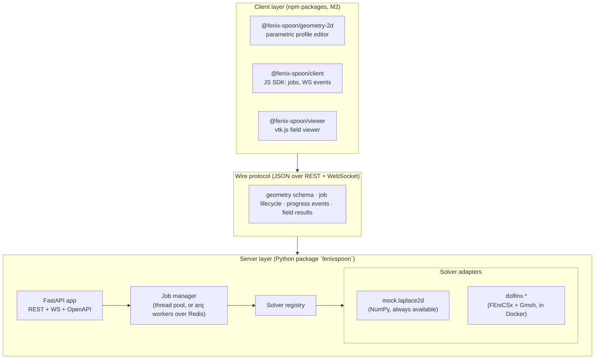

# Architecture

Fenix Spoon is three loosely-coupled layers joined by one contract (the
[wire protocol](04-wire-protocol.md)):



## Design principles

1. **The protocol is the product.** Widgets and server are replaceable; the JSON contract for
   geometry, jobs, events, and fields is what makes the ecosystem composable. It must stay
   language-neutral and versioned (`/api/v1`).
2. **Solvers are plug-ins.** The server core knows nothing about FEniCSx. A solver is any class
   implementing the `Solver` protocol (`name`, `describe()`, `solve(geometry, params, progress)`),
   registered in the registry. FEniCSx adapters register themselves only when dolfinx imports
   successfully, so the same codebase runs in a plain Python venv (mock solver) or in the dolfinx
   Docker image (real solvers).
3. **Front-end development must never require FEniCSx.** The mock solver (pure NumPy potential
   flow) returns the same result schema as the real adapters. Widget CI runs against it.
4. **Small results travel inline, large results travel by reference.** v0 returns 2D grid fields
   as JSON typed arrays (fine up to ~1M values). The protocol reserves an `artifacts` field for
   URLs to binary payloads (glTF, VTU/VTKHDF) for M1+.

## Component decisions and trade-offs

### API server: FastAPI
Async-native (WS streaming falls out for free), pydantic models double as protocol schema source,
OpenAPI docs for free. Alternative considered: trame — rejected as the *core* because it owns the
whole page and is hard to embed into an existing product front-end; it remains a fine consumer of
the same protocol.

### Job execution: staged approach
- **M0 (now):** in-process `asyncio` job manager running solves in a thread pool. Zero
  infrastructure, fine for demos and single-user tools. Progress callbacks are marshalled from the
  worker thread onto the event loop and fanned out to WebSocket subscribers; events are replayed to
  late subscribers.
- **M3 (landed):** resource limits, job persistence, API-key auth and per-principal quotas, and
  a pluggable execution backend. `FENIXSPOON_REDIS_URL` switches solving from a bounded thread
  pool in the API process to worker containers draining an arq queue; the API layer is unchanged
  either way, which is what the job-manager interface was shaped for.

  [Load testing](06-load-test.md) made the case concretely: one API process handles 50 concurrent
  clients without dropping a stream, but every in-process solve shares the interpreter with the
  event loop, so a Python-heavy solver's throughput *falls* as concurrency rises. Workers remove
  that ceiling, make a per-job memory limit expressible at last, and let the API scale separately
  from the solving.

### Distributed execution: three things cross the boundary, and only three
The API and its workers share a job store and a Redis, nothing else. What moves between them:

1. **The job**, as JSON on an arq queue — geometry and params, revalidated worker-side against
   the solver's own schema so a version skew fails at validation rather than reaching a solver
   as nonsense.
2. **Progress**, over Redis pub/sub. Pub/sub is lossy by design, which is fine because it is only
   the live edge: a subscriber attaches to the channel first, then replays the durable log from
   the store, and reconciles the overlap by sequence number. Neither path has to be reliable
   alone.
3. **Cancellation**, as a Redis flag the running solve polls. Still cooperative — nothing kills a
   solve mid-iteration — so the semantics match the in-process backend exactly.

Everything else (results, artifacts, status, history) goes through the store, which is why the
data directory has to be one shared volume. Redis holds no state worth keeping: lose it and
queued work is lost, but nothing that already happened is.

The honest gap is worker death. Nothing heartbeats, so a job whose worker is SIGKILLed stays
`running` until retention removes it — and the API deliberately does *not* fail running jobs on
startup in this mode, because in a healthy deployment those jobs really are still being solved.

### Persistence: live state in memory, everything else in a store
Subscriber queues, the cancel event and the running future cannot be serialized, so they stay in
the process. Everything a client can still ask for afterwards — metadata, the event log, the
result payload, the artifact list — goes to a `JobStore`. SQLite is the default backend and the
data directory is the durable unit: metadata and events in `jobs.db`, result payloads and
artifacts in `<data-dir>/<job-id>/`. Mount that directory and a restarted server answers for
jobs the previous one ran.

Result payloads live on disk rather than in the database on purpose: a 512×341 grid is several
megabytes of JSON, the data directory is already the durable-storage contract for artifacts, and
keeping them together makes one job's bytes one directory you can copy, delete or mount.

Restarting introduces a state the in-process manager never had: a job the store believes is
`running` that nothing is solving. Startup reconciliation fails those explicitly — a status
stream that can never terminate is worse than a job that admits it was lost.

### Geometry: parametric JSON, meshed server-side
Clients send parametric descriptions (v0: `polygon2d` obstacle in a rectangular domain; later:
spline profiles, axisymmetric sections, CSG of primitives). The server meshes with Gmsh
(OpenCascade kernel) and imports via `dolfinx.io.gmshio`. In-browser CAD kernels (OpenCascade.js)
are deliberately out of the core: heavy, and the mesh must be produced server-side anyway.

### Visualization: client-side rendering first
v0 renders 2D fields with raw canvas (demo) and M2 wraps vtk.js for a real viewer widget
(unstructured meshes, contours, vectors, 3D). Server-side rendering (trame-style image streaming)
is an escape hatch for huge models, not the default: client-side keeps interaction latency low and
the server stateless between jobs.

### Deployment: one Docker image
`server/Dockerfile` builds `FROM dolfinx/dolfinx:stable` (overridable via `BASE_IMAGE` build arg to
a plain `python:3.12-slim` for mock-only deployments). One image serves both roles — which one a
container is depends on its command, not its build. `docker-compose.yml` runs the API alone;
`docker-compose.workers.yml` layers on Redis and N worker containers.

## Security posture (why solvers are declarative)

A naive "FEniCS as a service" accepts Python/UFL code from the client — that's remote code
execution by design. Fenix Spoon's protocol instead exposes **named solvers with typed parameters**:
the client chooses *what* to solve from a server-defined menu, never *how*. Custom physics are
added by deploying a new adapter server-side. If arbitrary-UFL mode ever becomes a feature, it must
be opt-in and sandboxed (gVisor/firejail + resource limits), and that is explicitly out of scope
until M5.

Around that core sit the guardrails a multi-user deployment needs: a submit-time cell budget, a
cooperative wall-clock timeout, optional API-key auth with per-principal job isolation, and
per-principal quotas. All are off or unlimited by default, because the dev experience this
project exists to enable — clone, run, open a browser — must not require configuring an identity
provider. [Deployment](05-deployment.md) is the recipe for turning them on.

Identity is one replaceable object. `app.state.auth` resolves a presented credential to a
`Principal`; API keys are the implementation shipped, and OIDC or a trusted-proxy header is a
subclass. Everything downstream keys off `Principal.id`, so job ownership and quotas work
unchanged whatever produces it.

One limit is deliberately absent: a per-job memory ceiling. Solves run on threads in the API
process and a memory limit is a property of a process, so the honest enforcement points today
are the cell budget and the container's own limit. Per-job ceilings arrive with the worker
backend, where each solve is a process.

## Package layout (server)

```
server/fenixspoon/
├── main.py            # app factory, CORS, static demo mount
├── api.py             # /api/v1 routes: solvers, jobs, events WS, results
├── jobs.py            # JobManager: submit/status/events/result, retention, reconciliation
├── store.py           # JobStore: durable job metadata, event log and result payloads
├── execution.py       # run_solve: the one solve path, shared by pool and worker
├── backends.py        # ExecutionBackend: in-process pool, or arq over Redis
├── events.py          # EventBus: in-process fan-out
├── redis_bus.py       # EventBus over Redis pub/sub, for the worker deployment
├── worker.py          # arq entry point: `arq fenixspoon.worker.WorkerSettings`
├── auth.py            # Principal resolution (API keys), quotas, CORS policy
├── geometry.py        # pydantic models for the geometry schema (protocol source of truth)
└── solvers/
    ├── base.py        # Solver protocol, ProgressEvent, SolverResult
    ├── registry.py    # name → solver class, availability-aware
    ├── mock_laplace.py    # NumPy potential-flow solver (reference implementation)
    └── dolfinx_poisson.py # FEniCSx + Gmsh adapter (registers only if dolfinx imports)
```
