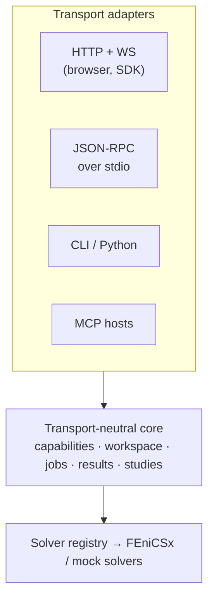

# Architecture

Fenix Spoon is three loosely-coupled layers joined by one contract (the
[wire protocol](04-wire-protocol.md)).

## Today


## Where this is going (M2.5, planned)

The browser is an important client, not the only one. A machine that has FEniCSx and local agents
should be able to use Fenix Spoon as a structured interface to its own compute environment,
through typed calls and compact answers. That turns the project from "a toolkit for putting
FEniCSx behind a web app" into **a queryable runtime and protocol for building, running and
automating FEniCSx-based engineering simulation workflows**.

Structurally it is one change: HTTP stops being the domain and becomes one adapter among several,
over a core that knows nothing about transports.



Half of that line already exists and was not built for this: `ExecutionBackend`, `EventBus`,
`JobStore` and `Principal` are exactly the seams a second caller needs, and they were pulled out
of the API layer so solves could cross a process boundary. What is still route-shaped is the
*request* side — solver lookup, geometry-kind checking, params validation, budget and quota
checks, artifact URLs, error mapping — which lives in `api.py` as `HTTPException`s and cannot be
reached from anywhere else. The milestone that finishes the job is
[M2.5](03-roadmap.md#m25-local-automation-and-agent-interface); the design specification is the
[local agent interface](07-local-agent-interface.md). Nothing in it is implemented yet. The
properties that layer is required to have:

- **Transport-neutral core.** Capability catalog, workspace, object store, job service, result
  query service and study service are plain Python objects with typed inputs and outputs. They
  raise domain errors, not `HTTPException`, and they never build URLs.
- **HTTP is an adapter, not the domain.** `api.py` becomes a mapping from routes to core calls
  and from domain errors to status codes. The `/api/v1` contract does not change; what changes is
  that JSON-RPC, CLI, Python and MCP can reach the same operations without going through FastAPI
  or a network port.
- **A local interface.** JSON-RPC 2.0 over stdio is the base local transport: the agent starts the
  process as a child, no port is opened, and long solves stay asynchronous jobs on the same
  execution backend. MCP is a thin adapter on top of the same operations, never a dependency of
  the core.
- **Progressive discovery.** Capabilities are described in sections on request (geometries,
  params, metrics, artifacts, environment requirements) rather than as one payload containing
  every schema. Extended schemas are fetched by reference.
- **Object references.** Geometries, materials, designs, studies and results live in a workspace
  under stable identifiers, so an iteration sends a patch and an id instead of a whole geometry —
  and a second run can reuse what did not change. That workspace extends the existing `JobStore`
  rather than becoming a second store.
- **Compact results.** `status`, `metrics`, `diagnostics`, `fields` and `artifacts` are distinct
  response levels. The default answer to "how did the solve go" is scalars and diagnostics — the
  result's `stats` are already the beginning of that — while nodal arrays are artifacts retrieved
  by reference or queried selectively (max, integral, value at a point, section, hotspots).
- **No arbitrary execution.** The local interface exposes engineering operations and domain
  objects. It does not accept Python, UFL, shell commands or container images — see the security
  posture below.

## Design principles

1. **The protocol is the product.** Widgets and server are replaceable; the JSON contract for
   geometry, jobs, events, and fields is what makes the ecosystem composable. It must stay
   language-neutral and versioned (`/api/v1`).
2. **Solvers are plug-ins.** The server core knows nothing about FEniCSx. A solver is any class
   implementing the `Solver` protocol (`name`, `describe()`, `solve(geometry, params, progress)`),
   registered in the registry. FEniCSx adapters register themselves only when dolfinx imports
   successfully, so the same codebase runs in a plain Python venv (mock solver) or in the dolfinx
   Docker image (real solvers).
3. **Front-end development must never require FEniCSx.** The mock solver (pure NumPy potential
   flow) returns the same result schema as the real adapters. Widget CI runs against it.
4. **Small results travel inline, large results travel by reference.** v0 returns 2D grid fields
   as JSON typed arrays (fine up to ~1M values). Binary payloads (VTU/XDMF, later glTF) travel as
   `artifacts` fetched by URL. For non-human consumers the same principle is sharpened at M2.5:
   the default answer is scalar metrics and diagnostics, and fields are fetched or queried
   explicitly.
5. **Transports are adapters, the core is the product** (planned, M2.5). HTTP/WebSocket,
   JSON-RPC over stdio, CLI, Python and MCP all map onto one application core with one set of
   models. An operation added to the core is available everywhere; a shared conformance suite
   keeps the adapters from drifting apart.

## Component decisions and trade-offs

### API server: FastAPI
Async-native (WS streaming falls out for free), pydantic models double as protocol schema source,
OpenAPI docs for free. Alternative considered: trame — rejected as the *core* because it owns the
whole page and is hard to embed into an existing product front-end; it remains a fine consumer of
the same protocol.

### Job execution: staged approach
- **M0 (now):** in-process `asyncio` job manager running solves in a thread pool. Zero
  infrastructure, fine for demos and single-user tools. Progress callbacks are marshalled from the
  worker thread onto the event loop and fanned out to WebSocket subscribers; events are replayed to
  late subscribers.
- **M3 (landed):** resource limits, job persistence, API-key auth and per-principal quotas, and
  a pluggable execution backend. `FENIXSPOON_REDIS_URL` switches solving from a bounded thread
  pool in the API process to worker containers draining an arq queue; the API layer is unchanged
  either way, which is what the job-manager interface was shaped for.
- **M2.5 (planned):** the same backends, driven from somewhere other than a route. Submitting a
  job stops being something only a FastAPI handler can do, and results gain a content-addressed
  identity so an equivalent resubmission hits a local cache instead of recomputing. No new
  execution path — a layering change on the existing one.

  [Load testing](06-load-test.md) made the case concretely: one API process handles 50 concurrent
  clients without dropping a stream, but every in-process solve shares the interpreter with the
  event loop, so a Python-heavy solver's throughput *falls* as concurrency rises. Workers remove
  that ceiling, make a per-job memory limit expressible at last, and let the API scale separately
  from the solving.
- **M2.5 (planned):** the manager surface (submit / get / cancel / subscribe) is lifted into a job
  *service* in the transport-neutral core, so a local process can drive jobs without an HTTP
  server. The `ExecutionBackend` split above already put the seam in the right place — what M2.5
  adds is a caller that is not FastAPI, plus a content-addressed result identity so an equivalent
  resubmission hits a local cache instead of recomputing. A layering change, not a second job
  system.

### Distributed execution: three things cross the boundary, and only three
The API and its workers share a job store and a Redis, nothing else. What moves between them:

1. **The job**, as JSON on an arq queue — geometry and params, revalidated worker-side against
   the solver's own schema so a version skew fails at validation rather than reaching a solver
   as nonsense.
2. **Progress**, over Redis pub/sub. Pub/sub is lossy by design, which is fine because it is only
   the live edge: a subscriber attaches to the channel first, then replays the durable log from
   the store, and reconciles the overlap by sequence number. Neither path has to be reliable
   alone.
3. **Cancellation**, as a Redis flag the running solve polls. Still cooperative — nothing kills a
   solve mid-iteration — so the semantics match the in-process backend exactly.

Everything else (results, artifacts, status, history) goes through the store, which is why the
data directory has to be one shared volume. Redis holds no state worth keeping: lose it and
queued work is lost, but nothing that already happened is.

The honest gap is worker death. Nothing heartbeats, so a job whose worker is SIGKILLed stays
`running` until retention removes it — and the API deliberately does *not* fail running jobs on
startup in this mode, because in a healthy deployment those jobs really are still being solved.

### Persistence: live state in memory, everything else in a store
Subscriber queues, the cancel event and the running future cannot be serialized, so they stay in
the process. Everything a client can still ask for afterwards — metadata, the event log, the
result payload, the artifact list — goes to a `JobStore`. SQLite is the default backend and the
data directory is the durable unit: metadata and events in `jobs.db`, result payloads and
artifacts in `<data-dir>/<job-id>/`. Mount that directory and a restarted server answers for
jobs the previous one ran.

Result payloads live on disk rather than in the database on purpose: a 512×341 grid is several
megabytes of JSON, the data directory is already the durable-storage contract for artifacts, and
keeping them together makes one job's bytes one directory you can copy, delete or mount.

That only pays if nothing quietly keeps a second copy, which is a discipline rather than a
guarantee, and it has to hold in two places. The live cache is **for jobs that are being solved**:
once a job is terminal its entry is dropped, because the only things it still held that the store
does not were the cancel handle and a status that had stopped moving — plus the payload. And a
store read fetches **only what the caller asked for**: a status poll, a cancel and an artifact
download take metadata alone, so `GET /jobs/{id}` does not pay for a multi-megabyte read to answer
with six fields, and a history page does not pay for it once per row.

Restarting introduces a state the in-process manager never had: a job the store believes is
`running` that nothing is solving. Startup reconciliation fails those explicitly — a status
stream that can never terminate is worse than a job that admits it was lost.

### Geometry: parametric JSON, meshed server-side
Clients send parametric descriptions (v0: `polygon2d` obstacle in a rectangular domain; later:
spline profiles, axisymmetric sections, CSG of primitives). The server meshes with Gmsh
(OpenCascade kernel) and imports via `dolfinx.io.gmshio`. In-browser CAD kernels (OpenCascade.js)
are deliberately out of the core: heavy, and the mesh must be produced server-side anyway.

### Visualization: client-side rendering, on canvas rather than vtk.js
The plan here was vtk.js; M2 shipped canvas instead, and the reason is the embed footprint. Every
result kind is 2D — `grid2d` and `mesh2d`, both scalar — so a multi-megabyte WebGL toolkit would
have dominated the download for capability nothing yet uses. `@fenix-spoon/viewer` draws both
kinds, with colormaps, a colorbar, iso-contours and a hover probe, in a fraction of that.

The drawing surface is isolated, so a WebGL backend can land with the first result kind that needs
it — 3D (#25), or vector fields, which the protocol does not yet carry and which is why the
Navier–Stokes example in #18 is blocked rather than merely unwritten.

Server-side rendering (trame-style image streaming) remains an escape hatch for huge models, not
the default: client-side keeps interaction latency low and the server stateless between jobs.

### Deployment: one Docker image
`server/Dockerfile` builds `FROM dolfinx/dolfinx:stable` (overridable via `BASE_IMAGE` build arg to
a plain `python:3.12-slim` for mock-only deployments). One image serves both roles — which one a
container is depends on its command, not its build. `docker-compose.yml` runs the API alone;
`docker-compose.workers.yml` layers on Redis and N worker containers.

## Security posture (why solvers are declarative)

A naive "FEniCS as a service" accepts Python/UFL code from the client — that's remote code
execution by design. Fenix Spoon's protocol instead exposes **named solvers with typed parameters**:
the client chooses *what* to solve from a server-defined menu, never *how*. Custom physics are
added by deploying a new adapter server-side. If arbitrary-UFL mode ever becomes a feature, it must
be opt-in and sandboxed (gVisor/firejail + resource limits), and that is explicitly out of scope
until M5.

Around that core sit the guardrails a multi-user deployment needs: a submit-time cell budget, a
cooperative wall-clock timeout, optional API-key auth with per-principal job isolation, and
per-principal quotas. All are off or unlimited by default, because the dev experience this
project exists to enable — clone, run, open a browser — must not require configuring an identity
provider. [Deployment](05-deployment.md) is the recipe for turning them on.

Identity is one replaceable object. `app.state.auth` resolves a presented credential to a
`Principal`; API keys are the implementation shipped, and OIDC or a trusted-proxy header is a
subclass. Everything downstream keys off `Principal.id`, so job ownership and quotas work
unchanged whatever produces it — including a future local transport, which authenticates by being
able to start the process and resolves to a principal like any other caller rather than bypassing
ownership.

**The declarative rule holds for the local agent interface too** (M2.5). It is tempting to hand an
agent `run_python(code)` or `execute_shell(command)` and call it a day — on a local machine the
agent often *can* run a shell anyway, so it feels free. It isn't: an interface made of arbitrary
execution has no schema to discover, no validation, no cache identity, no provenance, and cannot
later be exposed over a network without becoming remote code execution. The local interface
therefore exposes the same vocabulary as the HTTP API — named capabilities, typed parameters,
domain objects, engineering operations — and no `run_python`, `execute_shell`, `run_ufl`,
`install_package` or `start_container`. Agents translate human intent into typed requests; the
core validates and executes defined engineering operations.

One limit is deliberately absent: a per-job memory ceiling. Solves run on threads in the API
process and a memory limit is a property of a process, so the honest enforcement points today
are the cell budget and the container's own limit. Per-job ceilings arrive with the worker
backend, where each solve is a process.

**The same rule holds for the planned local agent interface.** It is tempting to hand an agent
`run_python(code)` or `execute_shell(command)` and call it a day — on a local machine the agent
often *can* run a shell anyway, so it feels free. It isn't: an interface made of arbitrary
execution has no schema to discover, no validation, no cache identity, no provenance, and cannot
later be exposed over a network without becoming remote code execution. The local interface
therefore exposes the same declarative vocabulary as the HTTP API — named capabilities, typed
parameters, domain objects, engineering operations — and no `run_python`, `execute_shell`,
`run_ufl`, `install_package` or `start_container`. Agents translate human intent into typed
requests; the core validates and executes defined engineering operations.

## Package layout (server)

```
server/fenixspoon/
├── main.py            # app factory, CORS, static demo mount
├── api.py             # /api/v1 routes: solvers, jobs, events WS, results
├── jobs.py            # JobManager: submit/status/events/result, retention, reconciliation
├── store.py           # JobStore: durable job metadata, event log and result payloads
├── execution.py       # run_solve: the one solve path, shared by pool and worker
├── backends.py        # ExecutionBackend: in-process pool, or arq over Redis
├── events.py          # EventBus: in-process fan-out
├── redis_bus.py       # EventBus over Redis pub/sub, for the worker deployment
├── worker.py          # arq entry point: `arq fenixspoon.worker.WorkerSettings`
├── auth.py            # Principal resolution (API keys), quotas, CORS policy
├── geometry.py        # pydantic models for the geometry schema (protocol source of truth)
├── protocol.py        # pydantic models for requests, events and result envelopes
└── solvers/
    ├── base.py        # Solver protocol, SolverContext, ProgressEvent, SolverResult
    ├── registry.py    # name → solver class, availability-aware
    ├── _gmsh.py       # shared Gmsh meshing helpers for the FEniCSx adapters
    ├── mock_laplace.py         # NumPy potential flow (reference implementation)
    ├── mock_magnetostatics.py  # NumPy magnetostatics over `regions2d`
    ├── mock_heat.py            # NumPy conduction with convective surfaces
    ├── dolfinx_poisson.py        # FEniCSx + Gmsh potential flow
    └── dolfinx_magnetostatics.py # FEniCSx + Gmsh magnetostatics
```

The FEniCSx adapters register only when dolfinx imports, so the same codebase runs in a plain
venv (mock solvers only) or in the dolfinx image (both).

`geometry.py`, `protocol.py`, `solvers/`, and the M3 modules (`store.py`, `backends.py`,
`events.py`, `execution.py`, `auth.py`) know nothing about FastAPI. `api.py` is where the remaining
coupling sits: request validation, budget and quota checks, artifact URLs and error mapping are
expressed as route bodies and `HTTPException`s, so no other caller can reuse them. M2.5 moves that
logic into a `core/` package (capability catalog, workspace, object store, job service, result
queries, studies) and leaves `api.py` as the HTTP adapter over it; the local transports live beside
it as peers rather than as clients of the web server.
