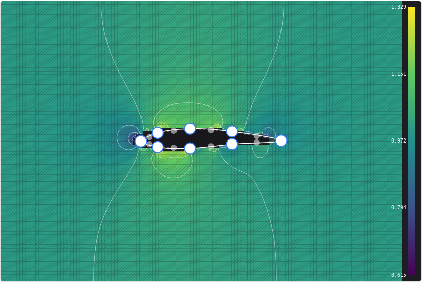
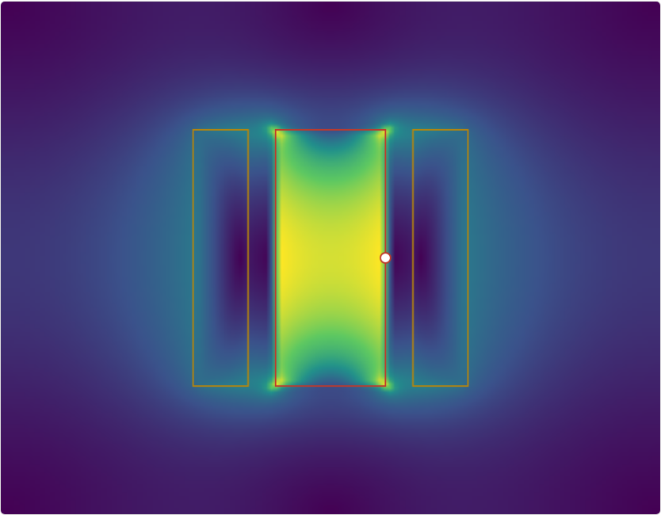
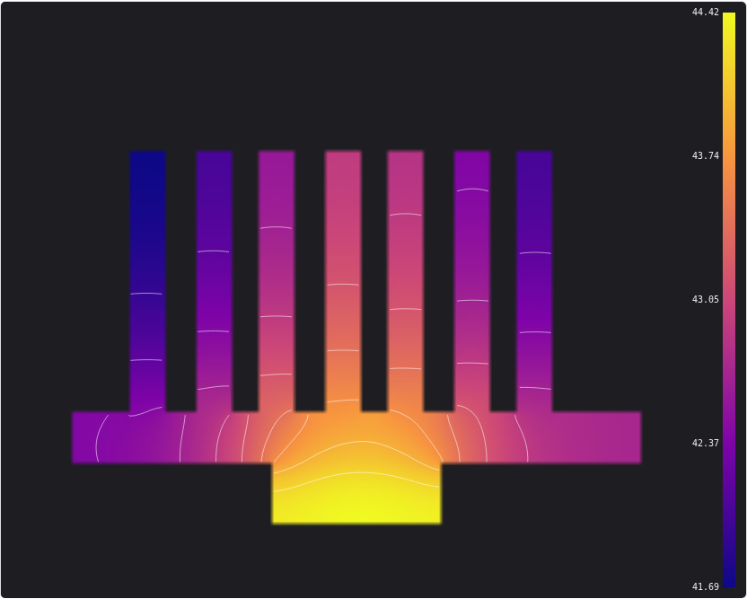

# Example gallery

Three worked examples, each a page you can read top to bottom and each chosen to exercise a
different part of the toolkit. All three run against the mock solvers with no FEniCSx installed,
and switch to the FEniCSx adapter automatically when the server has one.

```bash
npm --prefix client install && npm --prefix client run build   # once, for the widget demos
python -m uvicorn fenixspoon.main:app --app-dir server --reload
```

Then open <http://localhost:8000/demo/>. Screenshots below are from those pages, unmodified.

---

## Airfoil — 2D potential flow

[](https://github.com/mandaloriat/fenix-spoon/blob/main/examples/airfoil-2d/index.html)

Drag the control points of an airfoil and watch the flow field update on every edit. The
geometry is a `domain2d` — a rectangle with the body *cut out* — and the result is the real FEM
triangulation, rendered as `mesh2d`.

**What it shows:** the three widget packages composed into an app in about a hundred lines
(`@fenix-spoon/client`, `<fs-geometry-2d>`, `<fs-viewer>`), with the editor layered transparently
over the viewer. All the interaction — keyboard operation, undo, point insertion, contours, the
hover probe — comes from the packages.

There is also a [zero-dependency version](https://github.com/mandaloriat/fenix-spoon/blob/main/examples/airfoil-2d/index-vanilla.html)
in a single HTML file with no build step: the readable reference for exactly what goes over the
wire.

---

## Solenoid — 2D magnetostatics

[](https://github.com/mandaloriat/fenix-spoon/blob/main/examples/solenoid-2d/index.html)

An iron core between two coil sections carrying opposite-signed current density. Resize the core
and watch the flux redistribute; the image shows |B| with field lines as contours of the vector
potential.

**What it shows:** the `regions2d` geometry — named regions with material properties over a
background — and region-tagged meshing. The FEniCSx adapter gives every region its own Gmsh
physical group, so the iron/air interface lands on element edges rather than being staircased
onto a raster.

---

## Heat sink — conduction with convective cooling

[](https://github.com/mandaloriat/fenix-spoon/blob/main/examples/heat-sink-2d/index.html)

Aluminium fins on a base, heated from below by a chip. Add fins and the chip gets cooler —
about 5× from a bare base to twelve fins, measured through the page:

| fins | 0 | 2 | 5 | 9 | 12 |
|---|---|---|---|---|---|
| chip rise over ambient | 83.0 K | 48.8 K | 30.4 K | 20.6 K | 16.7 K |

**What it shows**, and it is two things the other examples do not.

**The parameter form is generated, not written.** Every control under the geometry sliders is
built from the `params_schema` that `GET /api/v1/solvers` publishes — bounds become slider
limits, `enum` becomes a `<select>`, `boolean` becomes a checkbox, and each field's `description`
becomes its tooltip. Add a parameter to a solver adapter and a control appears here without
anyone editing HTML. That is the argument for `params_schema` being part of the protocol rather
than being documentation.

**The background is not always a region.** `regions2d` carries a `background` material, and
`mock.magnetostatics2d` solves it as another material. `mock.heat2d` does the opposite: the
region set *is* the solid, everything else is fluid, and the fluid enters only as a convective
boundary condition on exposed faces — which is how heat sinks are actually analysed. The
result's `mask` marks the cells that were never solved, and the viewer greys them out. Model the
air as a conducting region instead and the fins stop working entirely: air conducts at
0.026 W/(m·K) against aluminium's 205, so heat cannot leave through them.

---

## Not here yet

**Incompressible Navier–Stokes** is the obvious fourth example and is
[blocked rather than unwritten](https://github.com/mandaloriat/fenix-spoon/issues/18): its
interesting output is a velocity *vector* field, and neither the protocol's result kinds nor the
viewer carries one. Adding it means a vector result kind and glyph rendering first — see the
[planned extensions](04-wire-protocol.md#planned-extensions-to-the-domain-contract).
