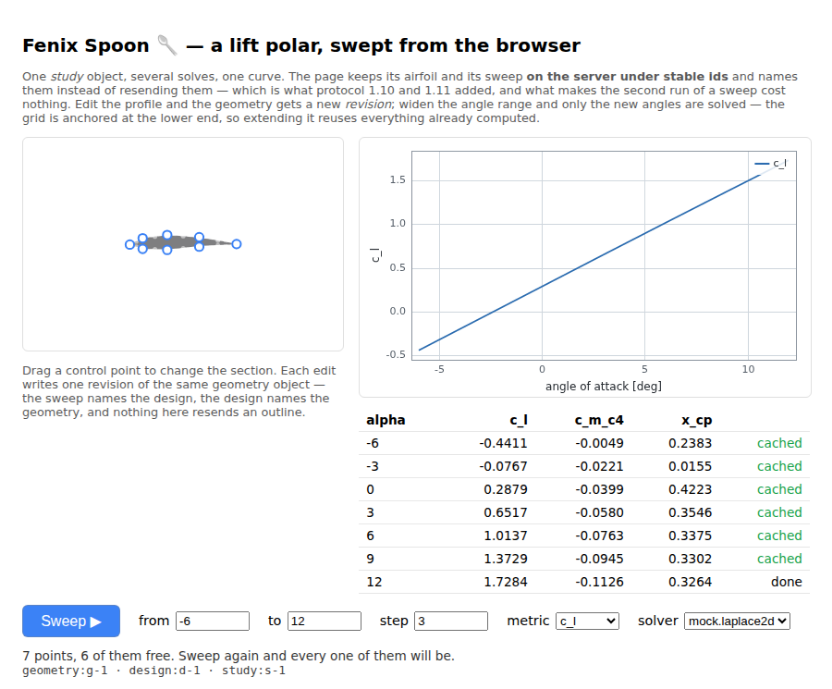

# Example gallery

Four worked examples, each a page you can read top to bottom and each chosen to exercise a
different part of the toolkit. All four run against the mock solvers with no FEniCSx installed,
and switch to the FEniCSx adapter automatically when the server has one.

```bash
npm --prefix client install && npm --prefix client run build   # once, for the widget demos
python -m uvicorn fenixspoon.main:app --app-dir server --reload
```

Then open <http://localhost:8000/demo/>. Screenshots below are from those pages, unmodified.

---

## Airfoil — 2D potential flow

[](https://github.com/mandaloriat/fenix-spoon/blob/main/examples/airfoil-2d/index.html)

Drag the control points of an airfoil and watch the flow field update on every edit. The
geometry is a `domain2d` — a rectangle with the body *cut out* — and the result is the real FEM
triangulation, rendered as `mesh2d`.

**What it shows:** the three widget packages composed into an app in about a hundred lines
(`@fenix-spoon/client`, `<fs-geometry-2d>`, `<fs-viewer>`), with the editor layered transparently
over the viewer. All the interaction — keyboard operation, undo, point insertion, contours, the
hover probe — comes from the packages.

**And it reports a lift coefficient**, which it could not until protocol 1.4. The streamfunction
solve used to hold the body on whichever streamline passed through its centroid — an arbitrary
constant that nevertheless *set the circulation*, so lift was an artefact of a heuristic and
nothing in the capability declaration said so. Both potential-flow adapters now impose the
**Kutta condition** at the trailing edge instead ([#68](https://github.com/mandaloriat/fenix-spoon/issues/68)):
one extra Laplace solve, one division, and `circulation`, `c_l`, `c_m_c4` and `x_cp` are real
numbers. The status line reads them from `metrics`. Pass `alpha` for incidence — it rotates the
free stream rather than the geometry, so nothing re-meshes — and the surface `C_p` distribution
comes back as a [`series`](04-wire-protocol.md#one-dimensional-results) beside the field.

The accuracy is what a first-order Cartesian grid gives: the lift-curve slope comes out about 9%
above the thin-airfoil `2*pi`, and a NACA 2412's zero-lift angle at -2.34° against the tabulated
-2.1°. The two independent routes to lift — Kutta–Joukowski from the circulation, and an integral
of the surface pressure — are compared on every run, and a disagreement past 25% becomes a warning
rather than being averaged into something that looks confident.

There is also a [zero-dependency version](https://github.com/mandaloriat/fenix-spoon/blob/main/examples/airfoil-2d/index-vanilla.html)
in a single HTML file with no build step: the readable reference for exactly what goes over the
wire.

---

## Solenoid — 2D magnetostatics

[](https://github.com/mandaloriat/fenix-spoon/blob/main/examples/solenoid-2d/index.html)

An iron core between two coil sections carrying opposite-signed current density. Resize the core
and watch the flux redistribute; the image shows |B| with field lines as contours of the vector
potential.

**What it shows:** the `regions2d` geometry — named regions with material properties over a
background — and region-tagged meshing. The FEniCSx adapter gives every region its own Gmsh
physical group, so the iron/air interface lands on element edges rather than being staircased
onto a raster.

---

## Heat sink — conduction with convective cooling

[](https://github.com/mandaloriat/fenix-spoon/blob/main/examples/heat-sink-2d/index.html)

Aluminium fins on a base, heated from below by a chip. Add fins and the chip gets cooler —
about 5× from a bare base to twelve fins, measured through the page:

| fins | 0 | 2 | 5 | 9 | 12 |
|---|---|---|---|---|---|
| chip rise over ambient | 83.0 K | 48.8 K | 30.4 K | 20.6 K | 16.7 K |

**What it shows**, and it is two things the other examples do not.

**The parameter form is generated, not written.** Every control under the geometry sliders is
built from the `params_schema` that `GET /api/v1/solvers` publishes — bounds become slider
limits, `enum` becomes a `<select>`, `boolean` becomes a checkbox, and each field's `description`
becomes its tooltip. Add a parameter to a solver adapter and a control appears here without
anyone editing HTML. That is the argument for `params_schema` being part of the protocol rather
than being documentation.

Both a NumPy solver and a FEniCSx one back this page. `mock.heat2d` relaxes on a Cartesian
raster; `dolfinx.heat2d` solves P1 elements on a Gmsh mesh of the solid. They are checked
against each other rather than only against themselves — an energy balance proves a scheme is
internally consistent, which is not the same as being right.

**The background is not always a region.** `regions2d` carries a `background` material, and
`mock.magnetostatics2d` solves it as another material. `mock.heat2d` does the opposite: the
region set *is* the solid, everything else is fluid, and the fluid enters only as a convective
boundary condition on exposed faces — which is how heat sinks are actually analysed. The
result's `mask` marks the cells that were never solved, and the viewer greys them out. Model the
air as a conducting region instead and the fins stop working entirely: air conducts at
0.026 W/(m·K) against aluminium's 205, so heat cannot leave through them.

---

## Lift polar — a parameter sweep, driven from the page

[](https://github.com/mandaloriat/fenix-spoon/blob/main/examples/polar-sweep/index.html)

Sweep the angle of attack and get a curve instead of a picture. The page owns one airfoil, one
design and one sweep; pressing **Sweep** solves the angles it has not solved before and nothing
else.

**What it shows** is the half of the toolkit the other three demos cannot reach: the browser can
now use the *workspace*. A geometry, a design and a study live on the server under stable ids
([protocol 1.10](04-wire-protocol.md#workspace-objects)), a study can be run and read over HTTP
([1.11](04-wire-protocol.md#studies)), and the page names those ids instead of resending an
outline on every request. Dragging a control point writes one **revision** of the same geometry
object rather than a new object, so the old revision stays readable and a result computed from
it can still say which shape it meant.

The consequence is visible in the rightmost column of the table. Sweep once and every row says
`done`; sweep again and every row says `cached`, because the result cache is content-addressed
and nothing about the question changed. Widen the range and only the angles that are new are
solved — the grid is a **step** from `from`, not N points between two ends, which is the
difference between a sweep that reuses and one that only claims to. A point count would move
every angle by a fraction of a degree and turn a widening into a full re-solve.

Two smaller things worth noticing. The study asks for three metrics out of the six the solver
declares, and gets three columns and three curves — `metrics` is part of the study body, not a
filter applied afterwards. And the plot is fed the study's response **unmodified**: a sweep
answers with `Series1DData`, which is the model `<fs-plot>` has taken since protocol 1.5, so
there is no adapter between the two. That was the point of choosing that model for sweeps.

---

## Not here yet

Five entries, and **four of them are the same sentence**: the capability ships, both halves of
the pair are cross-validated, and there is no page. That is worth saying out loud now that it
is a pattern rather than a backlog, because the reason is consistent and it is not the physics.
Three of the four are waiting on the *same* browser-side gap — a widget that can fetch and draw
**one member of an indexed family**: an instant of a transient, a mode shape, a section on axes
that are not x and y. The protocol has indexed those families since 1.7 and indexes two of them
now; `<fs-viewer>` still takes one field and draws it.

So the shortest path to three demos is one widget change, not three physics ones. That is the
kind of thing this section exists to make visible.

**Linear elasticity** has adapters but no page. `mock.elasticity2d` and
`dolfinx.elasticity2d` solve a clamped, loaded plate — displacement, von Mises stress, the
classical `K_t = 3` around a hole — and they are the first capabilities here whose unknown is a
*vector*. What they do not have is a demo: a structural page wants to draw a deformed shape and
to place a load somewhere other than a whole edge. The second of those was the open design
question in [#81](https://github.com/mandaloriat/fenix-spoon/issues/81) and is now answered —
[#85](https://github.com/mandaloriat/fenix-spoon/issues/85) lets the geometry name a boundary
and a load case say what happens on it, so a load can go on part of an edge, on a hole, or on
an interior outline. What is left is browser-side: the editor has to let a user click an edge,
name it, and keep that name across an edit. The capability is usable from every transport
today; it is the browser story that is missing.

**Transient heat** has adapters and no page for a specific reason worth reading. `mock.transient_heat2d`
and `dolfinx.transient_heat2d` answer the question the steady pair cannot — *when* does the sink
reach temperature — and they answer it as a **curve**: `T_max(t)` and `T_mean(t)` come back as a
`series1d`, and the field is the final instant only. That is enough for a script or an agent, and
it is not enough for a page: a browser demo wants a time slider, which means fetching the instant
you are looking at, and the protocol has no way to address one
([#82](https://github.com/mandaloriat/fenix-spoon/issues/82)). The adapters exist so that design
has a real consumer instead of a hypothetical one.

**Modal analysis** has adapters and no page, and what it is missing is a *widget* for the
answer rather than the answer itself. `mock.modal2d` and `dolfinx.modal2d` return the
spectrum as a curve `<fs-plot>` already draws and each mode shape as an artifact — but a
modal page wants the two *linked*: click a peak, see that shape. The viewer draws one field
at a time and the shapes cross as legacy VTK, so the page would need a fetch-and-parse step
the browser packages do not have. The same addressable-instant problem the transient pair has,
one ordering along.

**Axisymmetric electrostatics** has adapters and no page, and the missing piece is a widget
rather than a protocol gap. `mock.electrostatics_axi2d` and `dolfinx.electrostatics_axi2d`
solve a meridian (r, z) section of a body of revolution — potential, field magnitude, and the
capacitance in farads for the whole revolved body — checked against a coaxial section's
`2πεL/ln(b/a)` and driven by an adaptive-optics position sensor whose calibration curve is the
answer it exists to produce. What a page would need is an editor that draws the section on axes
marked *r* and *z*: `<fs-geometry-2d>` edits points on unlabelled ones, and labelling them is
the widget change [ADR 0003](adr/0003-axisymmetric-axis-label.md) leaves open — the SDK's
`axisLabels()` is where the labels come from when someone makes it.

**Incompressible Navier–Stokes** was the obvious fourth example when the vector half of the
protocol did not exist. It does now — protocol 1.1 added vector fields to both result kinds and
`<fs-viewer>` draws glyphs — so what remains is the solve rather than the wire: a nonlinear
steady solve, and for anything worth watching the same addressable-instant problem as above.
